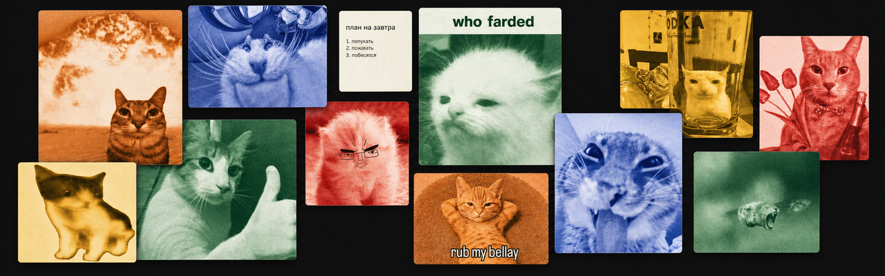

# Focus Overlay

Focus Overlay — маленькая программа для Windows, которая показывает задачи, заметки и картинки поверх других окон.

Например, можно закрепить задачу рядом с редактором, оставить шпаргалку поверх браузера или держать перед глазами картинку-референс.

## Что умеет программа

- Создавать карточки трёх видов: задача `✓`, заметка `✎` и изображение `▧`.
- Перемещать и растягивать каждую карточку отдельно.
- Всегда показывать карточки поверх обычных окон.
- Включать режим «Не мешать»: карточки остаются видны, но пропускают клики.
- Сохранять текст, картинки, размеры и положение карточек после перезапуска.
- Вставлять картинку через `Ctrl+V`.
- Принимать картинки, перетащенные из Проводника или браузера.
- Показывать изображение на всю карточку без заголовка.
- Работать полностью локально, без аккаунта и облака.

## Как пользоваться

1. Запусти Focus Overlay.
2. Нажми `✓`, `✎` или `▧`, чтобы создать карточку.
3. Наведи мышку на карточку — появятся кнопки перемещения и удаления.
4. Для картинки кликни по пустой области и нажми `Ctrl+V`. Ещё можно перетащить картинку мышкой.
5. Нажми `⛶`, чтобы картинка заполнила карточку целиком.
6. Нажми `⊘`, когда карточки должны перестать мешать работе.
7. Нажми `?`, если забыл значение символов.

## Горячие клавиши

- `Ctrl+Shift+F` — включить или выключить режим «Не мешать».
- `Ctrl+Shift+Space` — создать карточку из буфера обмена.
- `Ctrl+V` — вставить изображение в выбранную карточку-референс.

## Что нужно для запуска из исходников

- Windows 10 или Windows 11.
- [.NET 10 SDK](https://dotnet.microsoft.com/download/dotnet/10.0).

Открой PowerShell в папке проекта и выполни:

```powershell
dotnet restore
dotnet run --project src/FocusOverlay.App
```

## Как проверить проект

```powershell
dotnet build FocusOverlay.slnx -c Release
dotnet test FocusOverlay.slnx -c Release
```

## Как собрать отдельную папку с программой

```powershell
dotnet publish src/FocusOverlay.App -c Release -r win-x64 --self-contained true -o artifacts/win-x64
```

После сборки запускай `artifacts/win-x64/FocusOverlay.App.exe`.

## Где хранятся данные

Карточки сохраняются в `%LOCALAPPDATA%\FocusOverlay`. Они не отправляются в интернет. Исключение: если перетащить картинку из браузера, программа скачает именно эту картинку и сохранит её локальную копию.

## Статус

Это рабочий прототип. Основные функции уже готовы, но у программы пока нет установщика, автоматических обновлений и облачной синхронизации.

Подробное описание продукта находится в [`docs/prd/focus-overlay.md`](docs/prd/focus-overlay.md).
